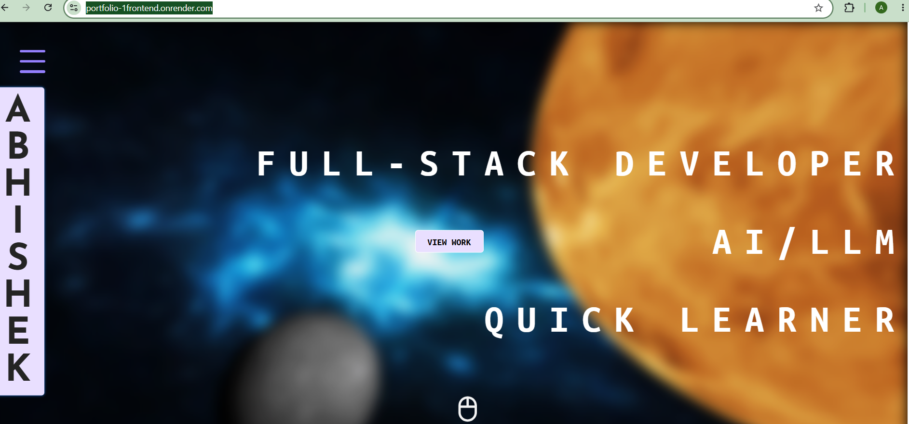
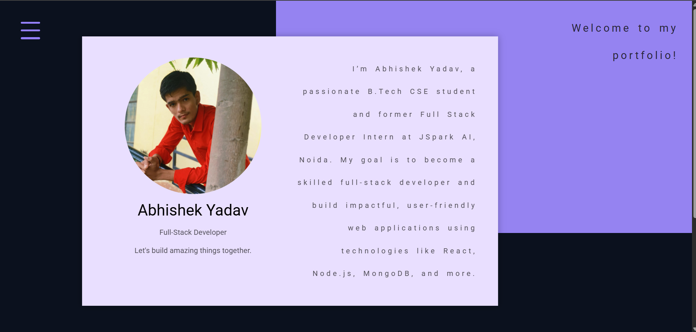
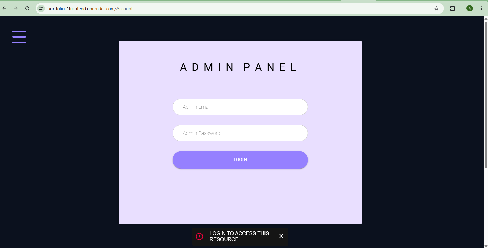

# 🌐 MERN Portfolio Website

A full-stack **Portfolio Website** built using the MERN stack (**MongoDB, Express.js, React.js, Node.js**) to showcase projects, skills, and provide a contact system.

---

## 🚀 Features

* 🧑‍💻 Personal Portfolio Showcase
* 📁 Projects Section
* 📜 Resume / About Section
* 📩 Contact Form with Email Integration
* 🔐 Authentication (JWT-based)
* ☁️ Image Upload using Cloudinary
* 📊 Admin Dashboard (Manage content)

---

## 🛠️ Tech Stack

### Frontend

* React.js
* Redux Toolkit
* Material UI (MUI)
* React Router DOM
* Axios

### Backend

* Node.js
* Express.js
* MongoDB (Mongoose)
* JWT Authentication
* Nodemailer

### Other Tools

* Cloudinary (Image Upload)
* dotenv (Environment Variables)

---

## 📁 Project Structure

```
portfolio/
│
├── backend/
│   ├── models/
│   ├── routes/
│   ├── controllers/
│   └── server.js
│
├── frontend/
│   ├── src/
│   ├── public/
│   └── package.json
│
├── package.json
└── README.md
```

---

## ⚙️ Installation & Setup

### 1️⃣ Clone Repository

```bash
git clone https://github.com/your-username/portfolio.git
cd portfolio
```

---

### 2️⃣ Install Backend Dependencies

```bash
npm install
```

---

### 3️⃣ Install Frontend Dependencies

```bash
cd frontend
npm install
```

---

### 4️⃣ Environment Variables

Create a `.env` file in **backend/**:

```
PORT=5000
MONGO_URI=your_mongodb_connection
JWT_SECRET=your_secret_key
CLOUDINARY_NAME=your_name
CLOUDINARY_API_KEY=your_key
CLOUDINARY_API_SECRET=your_secret
EMAIL_USER=your_email
EMAIL_PASS=your_password
```

---

### 5️⃣ Run the Project

#### Start Backend

```bash
npm start
```

#### Start Frontend

```bash
cd frontend
npm start
```

---

## 🌍 Live Demo

👉 

---https://portfolio-1frontend.onrender.com/


---

## 📸 Screenshots
#Home Page
<p align="center">
  
  
  
</p>


---

## 📦 Build for Production

```bash
cd frontend
npm run build
```

---

## 🧠 Learnings

* Full-stack development using MERN
* REST API design
* Authentication & Authorization
* State management using Redux
* Deployment on cloud platforms

---

## 🤝 Contributing

Contributions are welcome!
Feel free to fork this repo and submit a pull request.

---


## 👨‍💻 Author

**Abhishek Yadav**

* GitHub: https://github.com/abhi2J4


---


